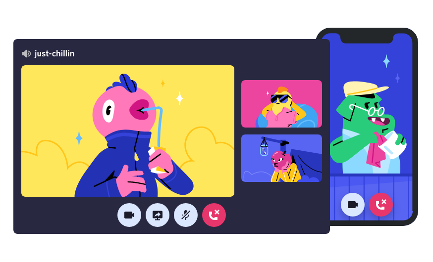

# Discord Landing Page Clone

Clone responsivo da página inicial do Discord desenvolvido com HTML e CSS.


## ✨ Funcionalidades

- Design totalmente responsivo
- Menu hambúrguer para mobile
- Múltiplas seções interativas
- Animações suaves

## 📁 Estrutura

```
├── index.html          # Página principal
├── style.css           # Estilos
├── image1.png          # Hero section
├── image2.png          # Seção canais
├── image3.png          # Seção comunidade
└── image4.png          # Seção voz/vídeo
```

## 📱 Screenshots

<table>
  <tr>
    <td></td>
    <td></td>
    <td></td>
  </tr>
</table>


---

⭐ **Gostou? Deixe uma estrela no repositório!**
